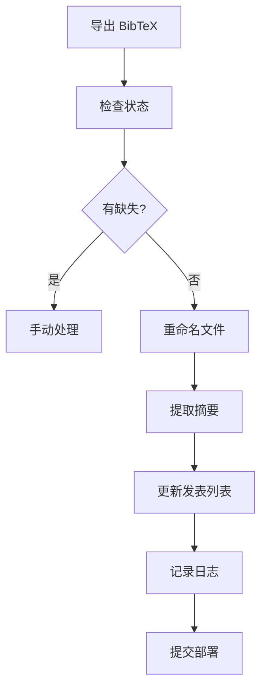

# 出版物管理完整工作流

本文档详细说明如何使用自动化工具管理学术出版物。

## 🎯 工作流概览



## 📚 完整流程

### 1. 导出 BibTeX 文件

从 Zotero 或其他文献管理器导出：

```bash
# 目标位置：项目根目录
My-Publications.bib
```

**Zotero 导出步骤**：
1. 选择 Library 或特定集合
2. File → Export Library
3. Format: BibTeX
4. 保存为 `My-Publications.bib` 到项目根目录

### 2. 运行完整更新流程

```bash
make full-update
```

这会引导你完成以下步骤：

#### Step 1/6: 检查出版物状态
- 检测缺失的出版物
- 识别重复项
- 显示 exact matches 和 title-based matches

#### Step 2/6: 检查 PDF 覆盖率
- 列出没有 PDF 的出版物
- 统计 PDF 覆盖率

**如果有缺失**：
```bash
# 手动创建缺失的出版物
cd content/en/publication/
mkdir missing_pub_key
# 添加 index.md 和 PDF
```

#### Step 3/6: 预览文件重命名
- 显示将要重命名的文件
- cite.bib 中的 key
- PDF 文件名

**确认后继续**

#### Step 4/6: 执行重命名
- 统一 cite.bib 的 citation key
- 重命名 PDF 为 `{citation_key}.pdf`

#### Step 5/6: 提取摘要（可选）
- 使用 OpenAI 从 PDF 提取摘要
- 自动生成简短总结
- 更新 index.md

**注意**：需要 OpenAI API Key，会产生少量费用

#### Step 6/6: 更新发表列表
- 用 XeLaTeX 编译 `publist/main.tex`
- 生成 PDF
- 复制到 `static/uploads/pubs.pdf`

### 3. 审查更改

```bash
# 查看所有更改
git diff

# 查看特定文件
git diff content/en/publication/wang2025g/index.md

# 查看日志
make show-log
```

### 4. 测试

```bash
# 启动本地服务器
make server

# 访问 http://localhost:1313
# 检查：
# - 出版物页面是否正常
# - PDF 链接是否有效
# - 摘要是否正确
```

### 5. 提交部署

```bash
# 方式 1: 快速部署
make deploy

# 方式 2: 分步操作
make commit   # 提交更改
make push     # 推送到 GitHub（自动部署）
```

## 🔧 各步骤详解

### 单独检查

```bash
# 只检查出版物状态
make check

# 只检查 PDF 覆盖率
make check-pdf
```

### 文件重命名

```bash
# 预览重命名（安全）
make preview-rename

# 执行重命名
make rename
```

**重命名规则**：
- `cite.bib`: `@article{old_key,` → `@article{folder_name,`
- PDF: `Long Title Name.pdf` → `citation_key.pdf`

### 摘要提取

```bash
# 设置 API Key（首次）
echo 'OPENAI_API_KEY=sk-your-key' > .env

# 提取摘要
make extract-abstracts
```

**配置**：
- 默认模型：`gpt-4o-mini`（经济实惠）
- 默认每次处理：10 篇
- 成本：约 $0.002/篇

### 更新发表列表

```bash
# 编译并更新 pubs.pdf
make update-publist
```

**要求**：
- `publist/` 目录存在
- XeLaTeX 已安装
- `My-Publications.bib` 可访问

## 📊 日志系统

### 查看日志

```bash
# 显示最近 50 行
make show-log

# 或直接查看文件
tail -100 logs/publications.log
```

### 日志特性

- ✅ 自动轮转（每 10MB）
- 📅 保留 3 个月
- 🗜️ 自动压缩旧日志
- 🔒 线程安全

### 清理旧日志

```bash
# 删除 3 个月以前的日志
make clean-logs
```

## 🎨 进阶使用

### 只更新特定出版物

```bash
# 只提取某个出版物的摘要
poetry run python scripts/extract_abstract_from_pdf.py --key wang2025g
```

### 强制重新提取

```bash
# 覆盖已有的摘要
poetry run python scripts/extract_abstract_from_pdf.py --key wang2025g --force
```

### 完全覆盖 index.md

```bash
# 创建最小化模板（只保留摘要）
poetry run python scripts/extract_abstract_from_pdf.py --key wang2025g --override
```

## 🔄 定期维护

### 每周

```bash
# 检查 PDF 覆盖率
make check-pdf

# 上传缺失的 PDF
```

### 每月

```bash
# 完整更新
make full-update

# 检查日志
make show-log
```

### 每季度

```bash
# 清理旧日志
make clean-logs

# 审查所有出版物
make check
```

## ⚠️ 注意事项

### 备份

在执行重命名前：
```bash
# 提交当前更改
git add -A
git commit -m "Before renaming"

# 或创建备份
cp -r content/en/publication content/en/publication.backup
```

### API 密钥安全

**不要**将 `.env` 提交到 git！

`.gitignore` 已包含 `.env`，但请确保：
```bash
# 检查 .env 是否被忽略
git check-ignore .env
# 应该输出：.env
```

### 成本控制

OpenAI API 费用：
- `gpt-4o-mini`: ~$0.0002/篇
- `gpt-4o`: ~$0.002/篇

限制处理数量：
```bash
# 只处理 5 篇
poetry run python scripts/extract_abstract_from_pdf.py --max-publications 5
```

## 🐛 故障排查

### 问题 1: XeLaTeX 编译失败

**症状**：`make update-publist` 失败

**解决**：
```bash
# 手动编译检查错误
cd publist
xelatex main.tex

# 查看 main.log 获取详细错误
```

### 问题 2: OpenAI API 错误

**症状**：摘要提取失败

**解决**：
```bash
# 检查 API Key
cat .env

# 测试单个文件
poetry run python scripts/extract_abstract_from_pdf.py --key wang2025g --dry-run
```

### 问题 3: 重命名冲突

**症状**：文件名已存在

**解决**：
```bash
# 使用 dry-run 检查
make preview-rename

# 手动解决冲突后重试
```

## 📖 相关文档

- [`README.md`](README.md) - 项目总览
- [`scripts/README.md`](scripts/README.md) - 脚本详细文档
- [`Makefile`](Makefile) - 所有可用命令

## 💡 最佳实践

1. **定期更新**：每次添加新论文后运行 `make full-update`
2. **先预览**：使用 `--dry-run` 确认更改
3. **小步提交**：完成每个步骤后提交 git
4. **测试本地**：部署前使用 `make server` 测试
5. **检查日志**：定期查看 `make show-log`

---

**快速开始**：
```bash
# 一键完成所有步骤
make full-update
```

